# 一级标题

## 二级标题

### 三级标题

#### 四级标题

##### 五级标题

###### 六级标题

## 内容目录

[TOC]

## 字体语法

*这里是斜体文字*
_这里是斜体文字_
**这里是粗体文字**
***这里是粗体斜体文字***
~~这里是删除线文字~~

## 链接语法

[这是显示的文本](这是文本的链接)

[百度一下，你就知道](baidu.com)

* 给链接增加一个Title

[百度一下，你就知道](baidu.com "搜索网站")

## 图片


[](跳转链接)

## 锚点

### 这是我的标题{#index}   //在某个标题后面设置锚点

跳转到[目录](#index)		//回到锚点

## 代码语法

 `printf("hello world");`

```java
printf("hello world");
```

## 引用

> 这是一个引用
> 这是一个引用
> 这是一个引用
> 这是一个引用
>
> 这是一个引用

> 这是一个引用
>
>> 这是一个嵌套引用

> **这是一个加粗的引用**
> 这是一个普通的引用

## 列表

* 我是无序列表
* 我是无序列表
* 我是无序列表
* 我是无序列表
* 我是无序列表
* 我是无序列表

1. 我是有序列表
2. 我是有序列表
3. 我是有序列表

## 表格

|列1|列2|列3|
|-|-|-|
|行1|11|1111|
|行2|222|111|

|列1|列2|列3|
|:-:|:-:|:-:|
|行1|11|1111|
|行2|222|111|

## 其他常用

* 换行
  + 连续两个以上空格+回车

* 特殊符号
  + 前面加反斜线\即可显示符号本身
  + \\          表示一个反斜线
  + \*          表示一个*
  + \{\}        表示一个{}

* 其他特殊字符
  + &#10003; 它是一个√
  + &#10052; 它是一个❄

## 高级用法

$公式$
$n*2$

$a^3_{2}$

$\sqrt{x}$

$\overline{m+n}$
$\underline{m+n}$

$\vec a$		表示向量a
$\overrightarrow{AB}$  表示向量AB，箭头指向右(即A->B)	
$\overleftarrow{AB}$   表示向量BA，箭头指向左(即A<-B)

$\frac{x^{2}}{k+1}$

$\frac{...}{...}$  来排版，前面表示分子，后面表示分母

求和：$\sum_{i=1}^{n}$		//按照$\sum_{...}^{...}$的格式
积分：$\int_{0}^{\pi}$		//按照$\int_{...}^{...}$的格式
求积：$\prod_{0}^{n}$		//同上两种类似，按照$\prod_{...}^{...}$的格式

## 流程图

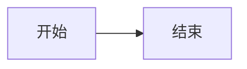

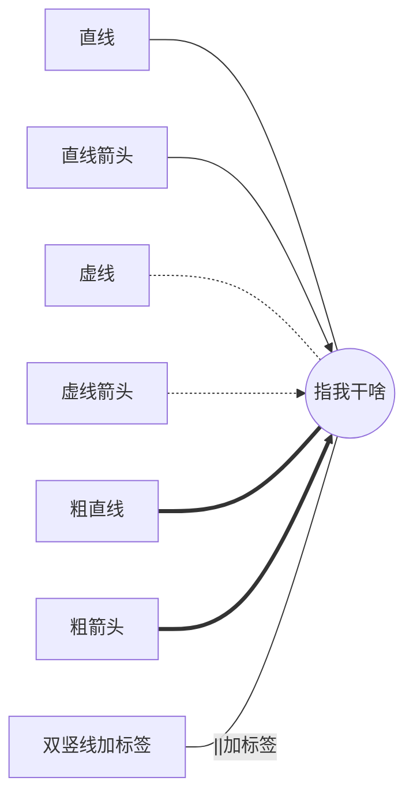

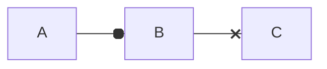

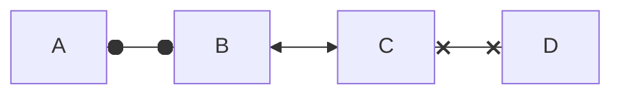

**连接线样式** 在 linkStyle 语句中定义的样式
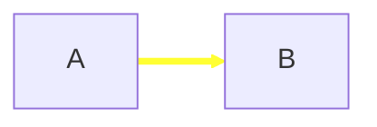

**节点样式** 可以为节点定义指定的样式，例如更粗的边框或不同的背景色：

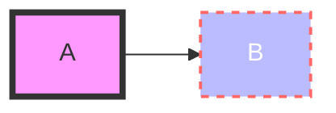

**类 Class** 比每次定义样式更方便的是定义一个样式 class，并将该 class 添加到不同的节点上。

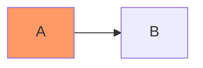

**跳转链接交换** 超链接在同一浏览器选项卡/窗口中打开。可以通过在 click 定义中添加链接目标来更改此设置 （支持 _self，_blank，_parent 和 _top）：

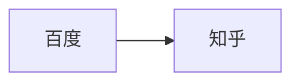

1. **多个连接关系：**

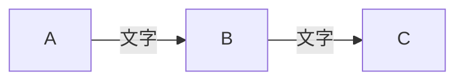

2. **多个节点连接：**

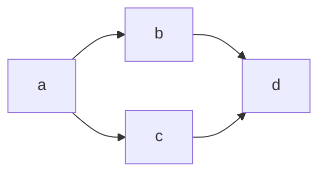

3. **简洁的依赖关系声明：**

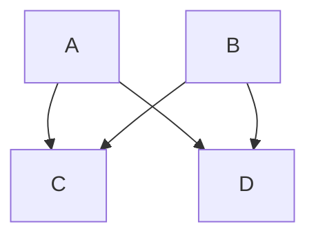


**子图**
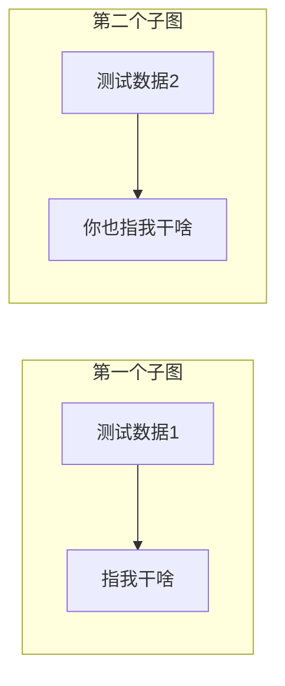

**多子图流转**
在多个子图中，可以在子图之间设置连接线，如下面的例子所示：
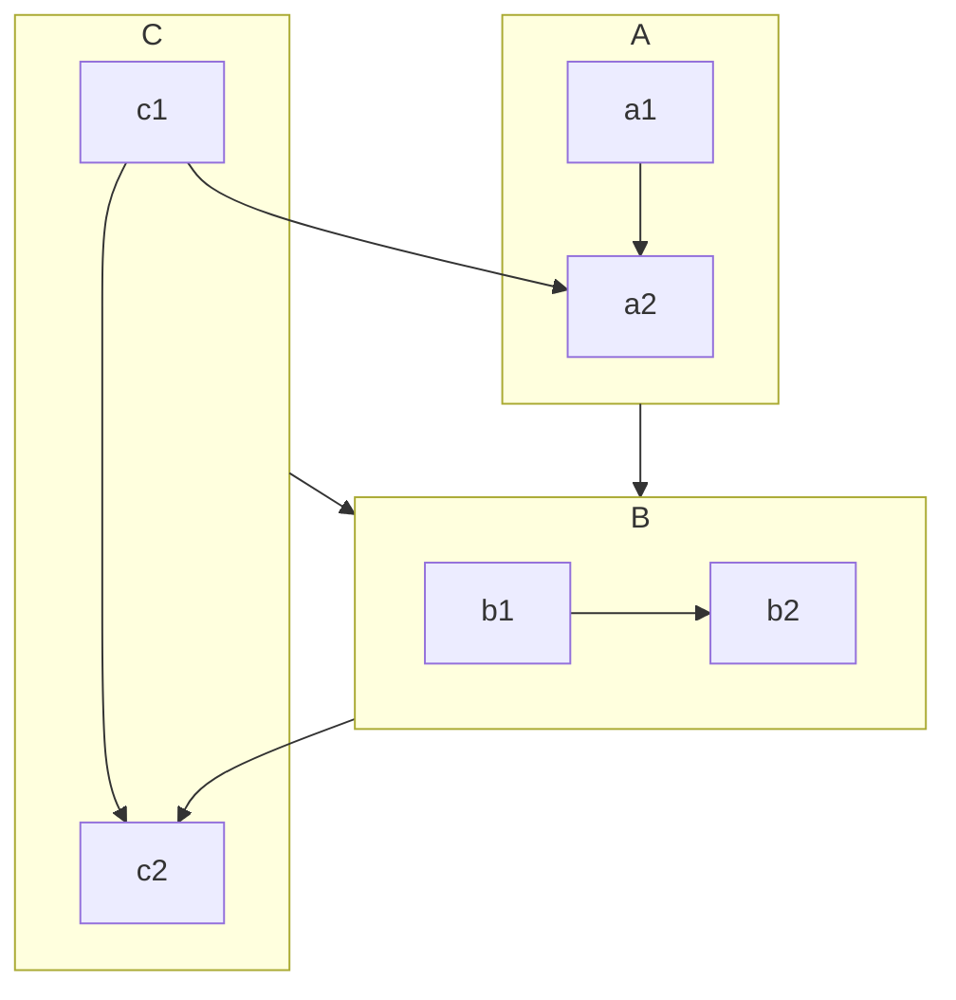

**子图的方向**
在多个流程图中，您可以使用方向语句来设置子图将呈现的方向，就像下面的例子所示：

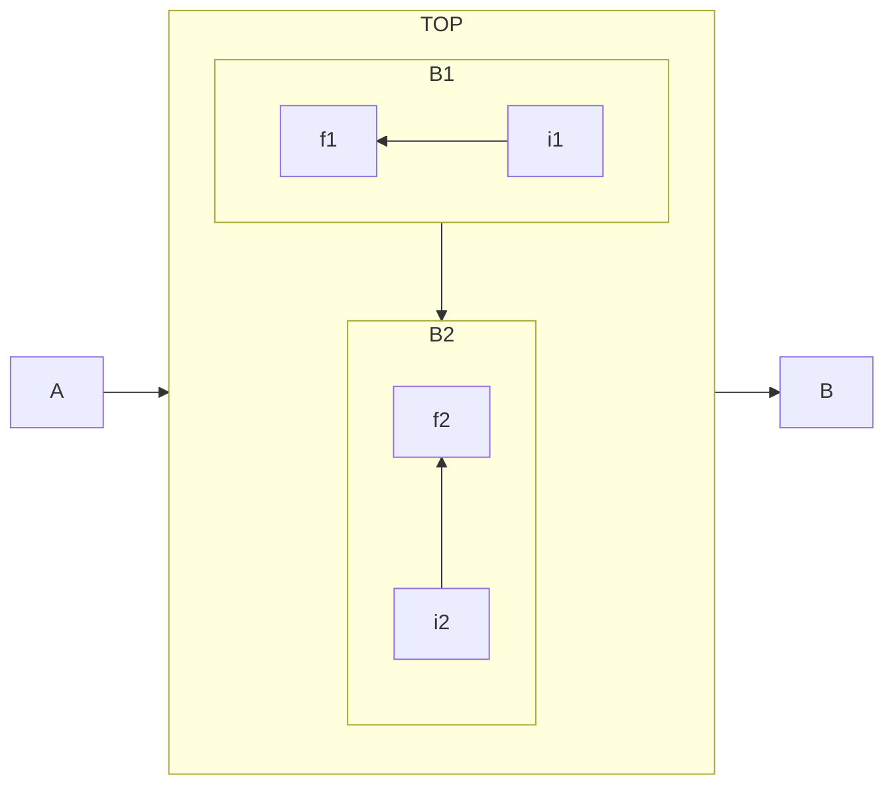

## 时序图

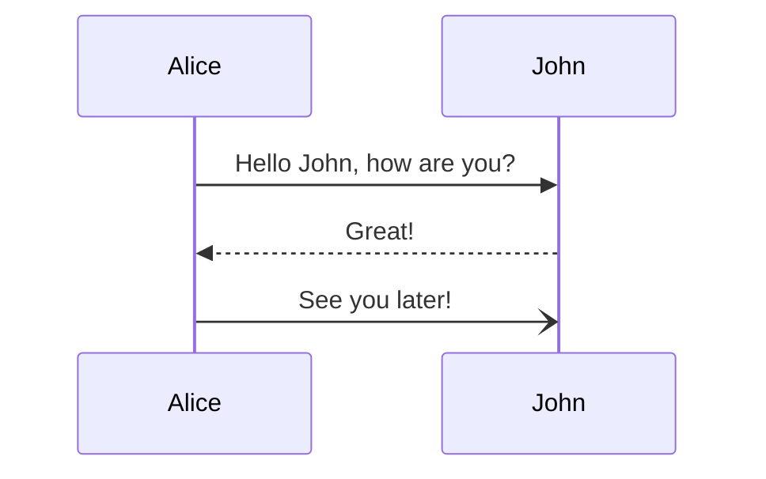

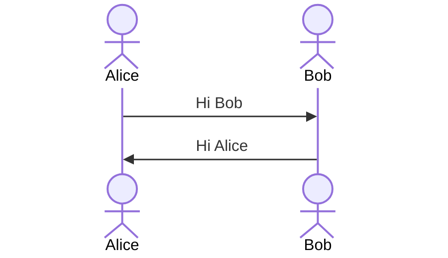

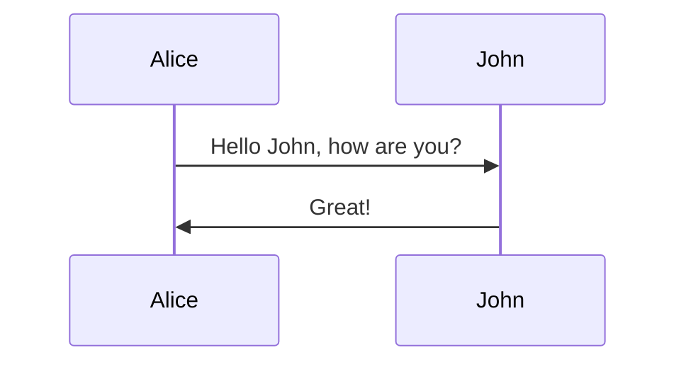

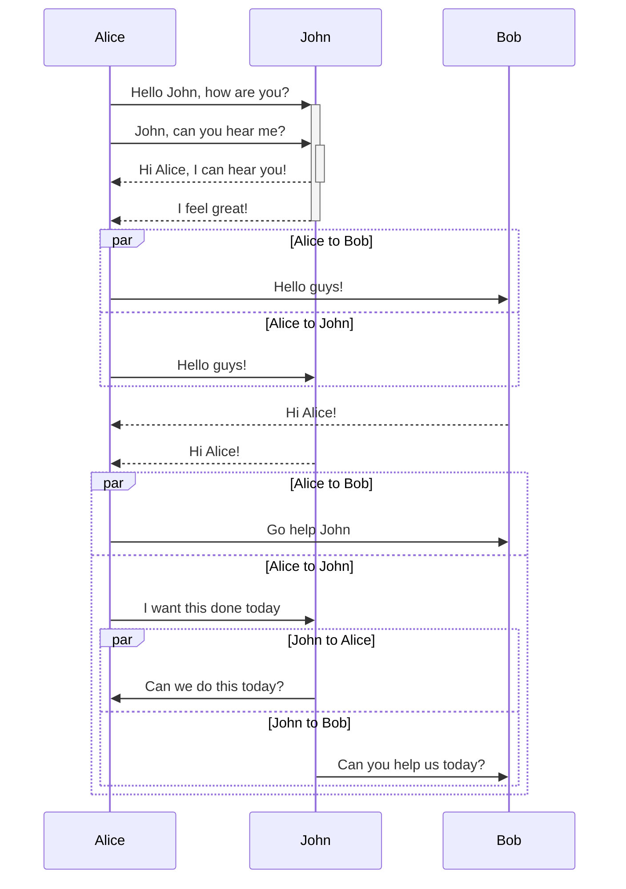


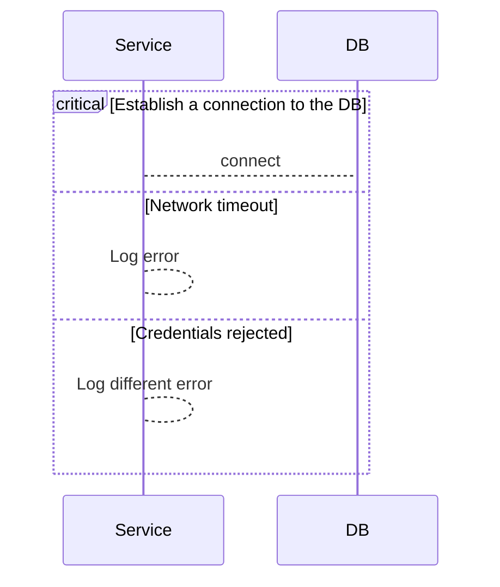


## 注脚

xxxx[^1]xxxxx

[^1]:xxxxx

> 脚注自动被搬运到最后面，请到文章末尾查看


```mermaid
graph TD
    A[U1: 入群操作]
        --> B[计算 H 值（HPKE）]
        --> C[生成签名（AEAD）]
        --> D[通过公钥树发送消息]
    E[U2: 入群操作]
        --> F[验证组上下文和成员信息]
        --> G[等待确认]
        --> H[处理成功]
    I[U3: 入群操作]
        --> J[计算退出 H 值（HPKE）]
        --> K[生成退出签名（AEAD）]
        --> L[通过公钥树发送退出消息]
    M[U4: 入群操作]
        --> N[验证退出消息]
        --> O[等待确认]
        --> P[退出成功]
    Q[U5: 退出操作]
        --> R[计算 H 值（HPKE）]
        --> S[生成签名（AEAD）]
        --> T[发送退出消息]
    U[U6: 退出操作]
        --> V[等待确认]
        --> W[验证消息]
```